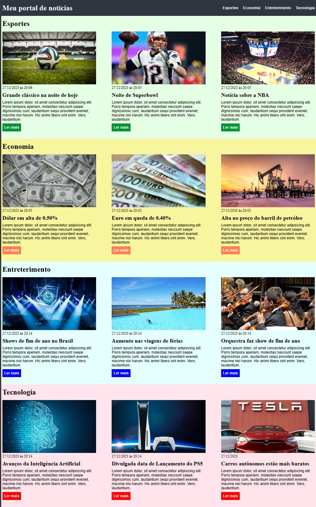

<h1 aling="center"> Learning-HTML-CSS-EBAC </h1>
___________________________________________________________________________
<h2 aling="center"> Exercise  </h2>

Repositório destinado a compartilhar o desenvolvimento inicial de **HTML** e **CSS** em meus estudos na plataforma **EBAC**, utilizando a IDE 
**VS_CODE**, usando o percurso de ensino da plataforma.
___________________________________________________________________________

___________________________________________________________________________
# Autor

| [ Ruannino Farias](https://github.com/ruannino) 
| :---: |
